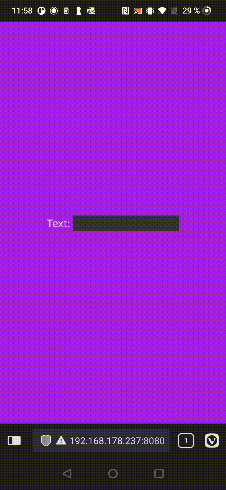

# MobileVirtualTextInput

Mobile devices with libgdx gwt public can't input text into text field as the keyboard doesn't show up.

This actor creates a html text field instead when the user clicks on the libgdx text field and just redirects all input into the libgdx text field.

Example with numbers filter:
